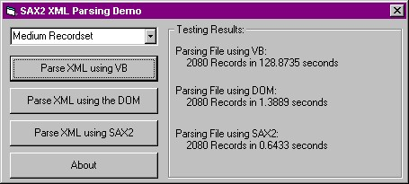



## Scalable XML Parsing Demo, featuring Microsoft's new MSXML SAX2 technology\!

### Description

This demo allows you to compare and benchmark 3 methods of XML Parsing available to VB.  

1. String Manipulation 

The first method is basic VB string manipulation, using functions such as Instr() and Mid().  

2. MSXML Document Object Model 

The second method uses the DOM methods provided with MSXML.  

3. MSXML 3.0 SAX2 

The final method uses the new SAX2 technology provided with MSXML 3.0.   

The benchmarking results will prove that SAX2 scales linearly while the DOM and VB string methods scale exponentially. SAX2 proves to be a highly scalable solution for parsing large XML recordset.  

This demo will be useful for those who are interesting in learning about XML parsing in VB, and especially useful for those who want to take advantage of Microsoft's new MSXML SAX2 technology. All the VB wrapper classes you will need are included with this demo.  

Before you run this demo, you will need to install Microsoft's MSXML 3.0 library. For instructions, see the Instructions.txt file included with the project.  

Don't forget to vote!!!
 
### More Info
 

             |
---                |---
**Submitted On**   |2001-02-15 12:15:14
**By**             |[David Drake](https://github.com/Planet-Source-Code/PSCIndex/blob/master/ByAuthor/david-drake.md)
**Level**          |Intermediate
**User Rating**    |4.8 (29 globes from 6 users)
**Compatibility**  |VB 6\.0
**Category**       |[String Manipulation](https://github.com/Planet-Source-Code/PSCIndex/blob/master/ByCategory/string-manipulation__1-5.md)
**World**          |[Visual Basic](https://github.com/Planet-Source-Code/PSCIndex/blob/master/ByWorld/visual-basic.md)
**Archive File**   |[CODE\_UPLOAD150142152001\.zip](https://github.com/Planet-Source-Code/david-drake-scalable-xml-parsing-demo-featuring-microsoft-s-new-msxml-sax2-technology__1-21035/archive/master.zip)

